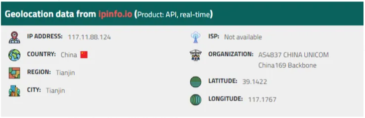

# [CyberDefenders - WebStrike Lab](https://cyberdefenders.org/blueteam-ctf-challenges/webstrike/)
Created: 08/09/2025 06:00 pm
Last Updated: 08/09/2024 06:00 pm
* * *
>**Category**: Network Forensics
>**Tags**: Wireshark, PCAP, Exfiltration
* * *
**Scenario**: An anomaly was discovered within our company's intranet as our Development team found an unusual file on one of our web servers. Suspecting potential malicious activity, the network team has prepared a pcap file with critical network traffic for analysis for the security team, and you have been tasked with analyzing the pcap.

**Tools**: Wireshark
* * *
## Questions
> Q1: Understanding the geographical origin of the attack aids in geo-blocking measures and threat intelligence analysis. What city did the attack originate from?

After taking a look at pcap file, There are only 2 IP addresses were captured.
Which `117.11.88.124` is probably the client (attacker) and `24.49.63.79` is a web server

I used [iplocation](https://www.iplocation.net/ip-lookup) to find both of IP addresses, attack was from the China and the web server was on the US so the answer is

  
Answer

<pre><code>Tianjin</code></pre>

> Q2: Knowing the attacker's user-agent assists in creating robust filtering rules. What's the attacker's user agent?

Follow HTTP or TCP stream of HTTP traffic, here is the user-agent of the attacker

  
Answer

<pre><code>Mozilla/5.0 (X11; Linux x86_64; rv:109.0) Gecko/20100101 Firefox/115.0</code></pre>

> Q3: We need to identify if there were potential vulnerabilities exploited. What's the name of the malicious web shell uploaded?

After browsing the website, the attacker found the upload page and used POST method to upload php reverse shell to the server which was a successful attempt.

  
Answer

<pre><code>image.jpg.php</code></pre>

> Q4: Knowing the directory where files uploaded are stored is important for reinforcing defenses against unauthorized access. Which directory is used by the website to store the uploaded files?

The php reverse shell was uploaded to this directory as a link

  
Answer

<pre><code>/reviews/uploads/</code></pre>

> Q5: Identifying the port utilized by the web shell helps improve firewall configurations for blocking unauthorized outbound traffic. What port was used by the malicious web shell?

Look at the content of php reverse shell, The port that was used is

  
Answer

<pre><code>8080</code></pre>

Which the attacker successfully gained the reverse shell from the server.

> Q6: Understanding the value of compromised data assists in prioritizing incident response actions. What file was the attacker trying to exfiltrate?

  
Answer

<pre><code>passwd</code></pre>

* * *
